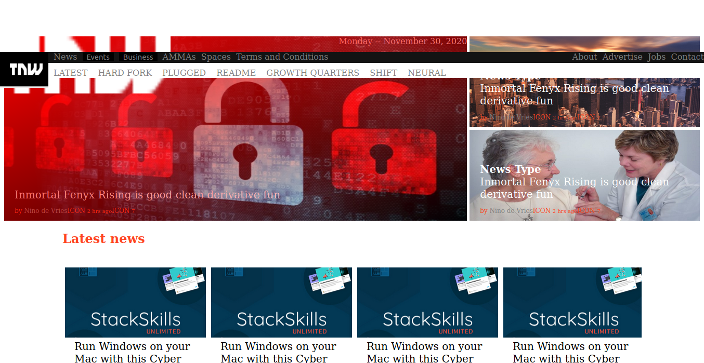

# Building with responsive desing-

This project is a clone of a the https://thenextweb.com/

# Getting started :

this website can be viewd better on the screen size of of 1920 X 1080 in Mozilla firefox browser or chrome.
you can also download the repo and open the ''index.html" file with Mozilla Firefox.

The purpose of these project is to help us understand a way of creating a web page similar to "The next web", website
utilizing media querys, and all the concepts that we learned about HTML and CSS like
flexbox, float and grid. So using Responsive Design we may be able to change the
size of the window and our web page may response to that re-sizing the elements.

## BUILT WITH

    -HTML
    -CSS

## LIVE DEMO

[Live Demo Link](https://fdi96.github.io/Building-with-responsive-desing/)

## AUTHORS

👤 **Federico Ignacio Lopez Cechini**

- GitHub: [@FdI96](https://github.com/FdI96)
- Twitter: [@federicolopezc7](https://twitter.com/federicolopezc7)
- LinkedIn: [LinkedIn](https://www.linkedin.com/in/federico-ignacio-3285411a4/)

👤 **Iyunda Ismael Antonio**

- GitHub: [@ixboy](https://github.com/ixboy)
- Twitter: [@ismaelixboy](https://twitter.com/ismaelixboy)
- LinkedIn: [ismael-antonio](https://www.linkedin.com/in/ismael-antonio-0b7712114/)

## SHOW YOUR SUPPORT

Give a \* if you like the project

## 🤝 Contributing

Contributions, issues, and feature requests are welcome!

Feel free to check the issues page. Show your support

Give a ⭐️ if you like this project!

## 📝 License MIT

Microverse Project 2: Building with responsive desing...
